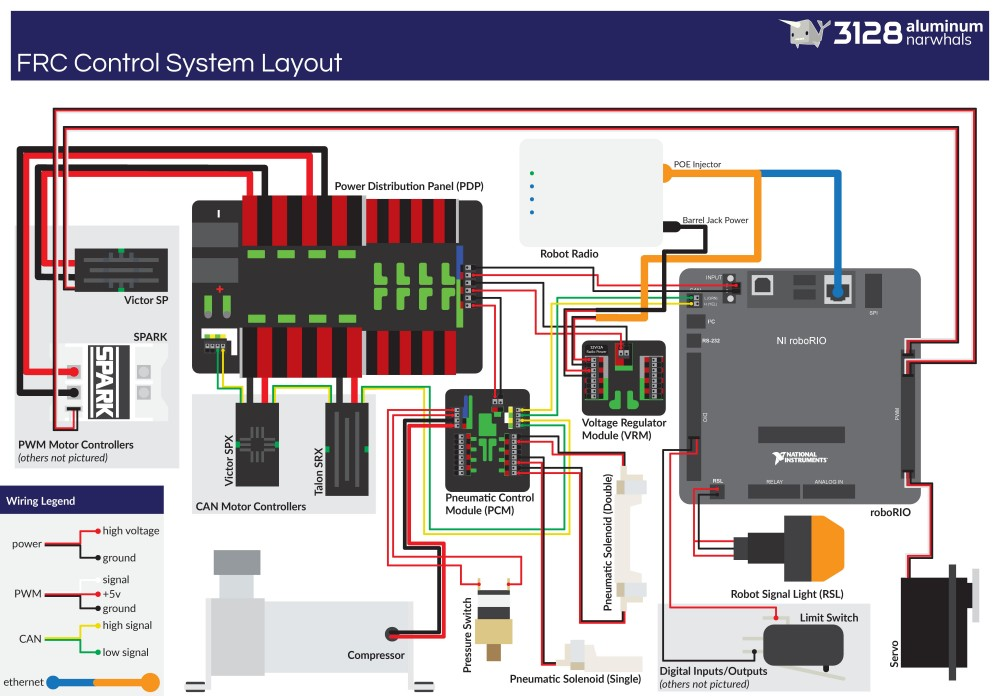

# WpiLib, c'est quoi ?

## Comment contrôle-t-on un robot ?

Le robot est controlé par le RoboRio, l'ordinateur du robot. C'est lui qui va par exemple envoyer les ordres aux moteurs et aux verins. Il reçoit aussi les informations venant des capteurs du robot (encodeurs, ultrasons, ...).

Le RoboRio est connecté par ethernet à la borne wifi du robot. Elle permet la communication à distance entre l'ordinateur du pilote et le RoboRio.

Voici un schéma des branchements du robot pour mieux comprendre :

Sur l'ordinateur du pilote, c'est le programme appelé `FRC Driver Station` qui permet de communiquer avec le robot. Il fait ainsi le lien entre le joystick et le RoboRio. Le RoboRio doit être connecté à la Driver Station pour pouvoir contrôler le robot.

## Et WpiLib dans tout ça ?

### Présentation

WpiLib (Worcester Polytechnic Institute Robotics Library) est une bibliothèque qui permet le programmation du RoboRio. C'est un ensemble de classes qui permettent l'interface entre le logiciel et le hardware.

Cette librairie nous fournit des classes pour gérer les moteurs, la pneumatique, les capteurs et à peu près tout ce dont nous avons besoin pour contrôler un robot. C'est une bibliothèque de haut-niveau, c'est à dire qu'elle nous permet de manipuler facilement des objets complexes.

WpiLib est disponible en C++ et en Java. Il existe aussi des versions non-officiellement supportées en Python ou en Kotlin.

### Installation

Pour programmer le robot en C++ et en Java, WpiLib propose d'utiliser Visual Studio Code qui est l'IDE officiellement supporté.
Pour installer l'environnement de programmation, un installer Windows est disponible. Les instructions sont à retrouver [ici](https://wpilib.screenstepslive.com/s/currentCS/m/cpp/l/1027500-installing-c-and-java-development-tools-for-frc).

VS Code permet l'utilisation des classes de WpiLib mais aussi de deployer le programme sur le robot.

## Documentation

Pour obtenir des informations sur la librairie, savoir à quoi sert quelle classe, quelles fonctions sont disponibles, ect..., [une documentation](http://first.wpi.edu/FRC/roborio/release/docs/cpp/) est disponible. Chaque classe y est répertoriée avec la description de chacune des méthodes qu'elle propose.