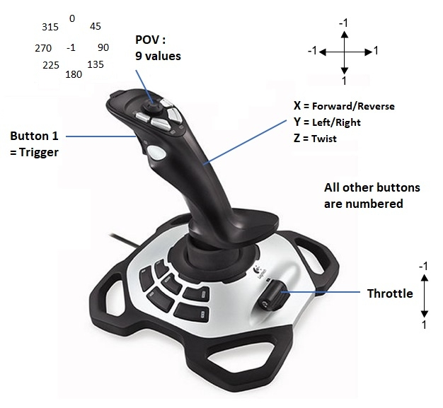

# Lire les entrées d'un joystick

## Le Joystick

Pour permettre au pilote de contrôler le robot, celui-ci utilise un joystick. Nous pouvons aussi utiliser une manette de Xbox.

Le joystick que nous utilisons est le Logitech 3D Pro. Il possède 3 axes (avant/arrière, gauche/droite et twist), 12 boutons, un POV (bouton avec 9 positions possibles) et un throttle (manette type avion).



On peut connaitre l'état de chaque bouton/axe du joystique en temps réel sur la Driver Station :


## Dans le Code

WpiLib fournit un objet `Joystick` qui nous permet de récuperer les infos de celui-ci. Son constructeur attend en argument le numéro du joystick. Par exemple, si on a un seul joystick il aura pour numéro 0 :
```c++
#include <frc/Joystick.h>

frc::Joystick mon_joystick{0};
```

Pour récuperer l'état d'un bouton (appuyé/relaché, on peut utiliser la méthode `bool GetRawButton(int button)` qui attend en argument le numéro du boutton et qui renvoit `true` si le boutton est appuyé et `false` si il est relaché.
```c++
// Recupere l'état de la gachette (trigger)
bool gachetteAppuyee = mon_joystick.GetRawButton(1);
```

Pour récupérer la position d'un axe entre -1 et 1, on peut utiliser les méthodes `double GetX()`, `double GetY()`, `double GetZ()` (ou `GetTwist()`) et `double GetThrottle()`.
```c++
// Recupere l'état de chaque axe
double x = mon_joystick.GetX();
double y = mon_joystick.GetY();
double twist = mon_joystick.GetTwist();
double throttle = mon_joystick.GetThrottle();
```

On a aussi la méthode `int GetPOV()` qui renvoi l'angle formé par le POV ou -1 si il est situé au centre.
```c++
int pov = mon_joystick.GetPOV();

switch (pov)
{
    case -1:
        // Centre
        break;

    case 0:
        // Haut
        break;

    case 180:
        // Bas
        break;

    case 90
        // Droite
        break;

    case 270
        // Gauche
        break;
}
```