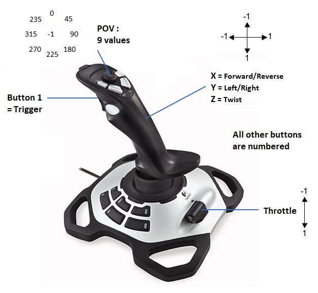

# Lire les entrées d'un joystick

## Le Joystick

Pour permettre au pilote de controller le robot, celui-ci utilise un joystick. Nous pouvons aussi utiliser une manette de Xbox.

Le joystick que nous utilisons est le Logitech 3D Pro. Il possède 3 axes (avant/arrière, gauche/droite et twist), 12 boutons, un POV (bouton avec 9 positions possibles) et un throttle (manette type avion).



On peut connaitre l'état de chaque bouton/axe du joystique en temps réel sur la Driver Station :


## Dans le Code

WpiLib fournit un objet `Joystick` qui nous permet de récuperer les infos de celui-ci. Son constructeur attend en argument le numéro du joystick. Par exemple, si on a un seul joystick il aura pour numéro 0 :
```c++
#include <frc/Joystick.h>

frc::Joystick mon_joystick{0};
```