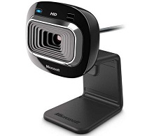

Streamer une video
==================

Partager un flux vidéo peut s'avérer utile en match. En effet, voir sur son PC
la vue d'une caméra montée sur le robot peut aider le pilote à se positionner
correctement sur le terrain.

Quelle camera ?
---------------

Le RoboRio possède deux ports USB. C'est pourquoi il est possible d'utiliser
des caméras USB avec celui-ci. Ces cameras sont pratiques car disponibles
partout dans le commerce, bon marché, faciles à remplacer et à brancher.

Une des caméras USB les plus utilisées en FRC est la **Microsoft LifeCam HD-3000** :

Il existe aussi des caméras IP qui permettent directement de streamer un flux
vidéo sur le réseau. Cependant, celles-ci sont de moins en moins utilisées.

Dans le code
------------

Bien évidement, WPILib a créé une classe afin de streamer le flux vidéo d'une
caméra USB. Il s'agit de la classe `CameraServer <https://first.wpi.edu/FRC/roborio/release/docs/cpp/classfrc_1_1CameraServer.html>`__.

Le constructeur de cette classe est privé, on ne peut donc pas créer
d'instances de cette classe. Au lieu de cela, il est possible de recupérer
l'unique instance de la classe grâce à la méthode ``static CameraServer* GetInstance ()``.

.. note::
    Les variables et les fonctions membres ``static`` appartiennent à la classe
    mais pas aux objets instanciés à partir de la classe. Une fonction membre
    déclarée ``static`` a ainsi la particularité de pouvoir être appelée sans
    devoir instancier la classe.

Après avoir recupérer un pointeur sur l'instance de la classe, on peut
utiliser ses méthodes :

La fonction `cs::UsbCamera StartAutomaticCapture() <https://first.wpi.edu/FRC/roborio/release/docs/cpp/classfrc_1_1CameraServer.html#af4b39b0179578e1959aaa41dcf5e1790>`__
crée un flux vidéo à partir de la caméra USB n°0. Elle renvoie aussi une
instance de la classe `UsbCamera <https://first.wpi.edu/FRC/roborio/release/docs/cpp/classcs_1_1UsbCamera.html>`__
créée :

.. code-block:: c++

    #include <CameraServer.h>
    CameraServer::GetInstance()->StartAutomaticCapture();

Il existe aussi d'autres méthodes qui permettent de recupérer les images du
flux pour, par exemple, les analyser. 

Les alternatives
----------------

Utiliser le RoboRio pour streamer un flux vidéo n'est pas toujours la
meilleure solution. En effet, le processeur du RoboRio n'est pas adapté à la
compression vidéo et le flux vidéo utilise ainsi une grande partie de la bande
passante.

Pour pouvoir utiliser moins de bande passante, il peut alors être intéressant
d'avoir recours à un coprocesseur comme un Raspberry Pi. Celui-ci pourra alors
utiliser un codec vidéo plus avantageux comme le H.264.
